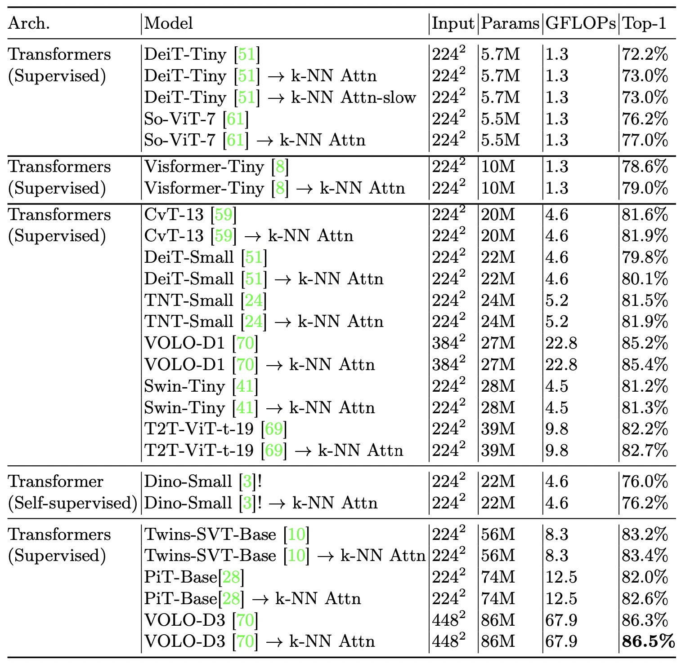

# KVT

This repository contains PyTorch evaluation code, training code and pretrained models for the following project:
* K-NN Attention for Boosting Vision Transformers, ECCV 2022

For details see [K-NN Attention for Boosting Vision Transformers](https://arxiv.org/abs/2106.00515) by Pichao Wang, Xue Wang, Fan Wang, Ming Lin, Shuning Chang, Hao Li, Rong Jin. 

The code is based on [DeiT](https://github.com/facebookresearch/deit).

## Results on ImageNet-1K


# Usage

First, clone the repository locally:
```
git clone https://github.com/damo-cv/KVT.git
```
Then, install PyTorch 1.7.0+ and torchvision 0.8.1+ and [pytorch-image-models 0.3.2](https://github.com/rwightman/pytorch-image-models):

```
conda install -c pytorch pytorch torchvision
pip install timm==0.4.12
```

## Data preparation

Download and extract ImageNet train and val images from http://image-net.org/.
The directory structure is the standard layout for the torchvision [`datasets.ImageFolder`](https://pytorch.org/docs/stable/torchvision/datasets.html#imagefolder), and the training and validation data is expected to be in the `train/` folder and `val` folder respectively:

```
/path/to/imagenet/
  train/
    class1/
      img1.jpeg
    class2/
      img2.jpeg
  val/
    class1/
      img3.jpeg
    class/2
      img4.jpeg
```

## Training
To train DeiT-KVT-tiny on ImageNet on a single node with 4 gpus for 300 epochs run:

DeiT-KVT-tiny
```
python -m torch.distributed.launch --nproc_per_node=4 --use_env main.py --model deit_tiny_patch16_224 --batch-size 256 --data-path /path/to/imagenet --output_dir /path/to/save
```

## Citation
If you use this code for a paper please cite:

```
@article{wang2021kvt,
  title={Kvt: k-nn attention for boosting vision transformers},
  author={Wang, Pichao and Wang, Xue and Wang, Fan and Lin, Ming and Chang, Shuning and Xie, Wen and Li, Hao and Jin, Rong},
  journal={arXiv preprint arXiv:2106.00515},
  year={2021}
}
```
